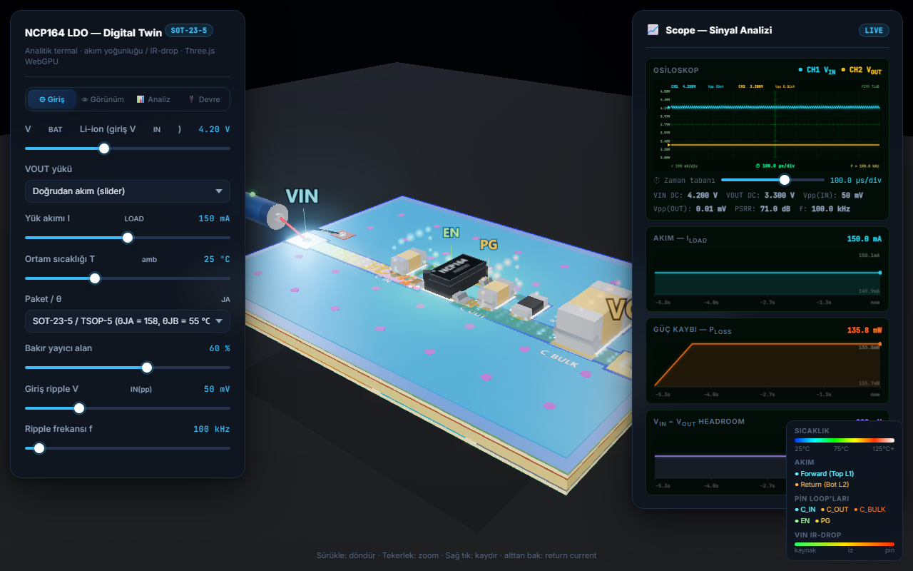
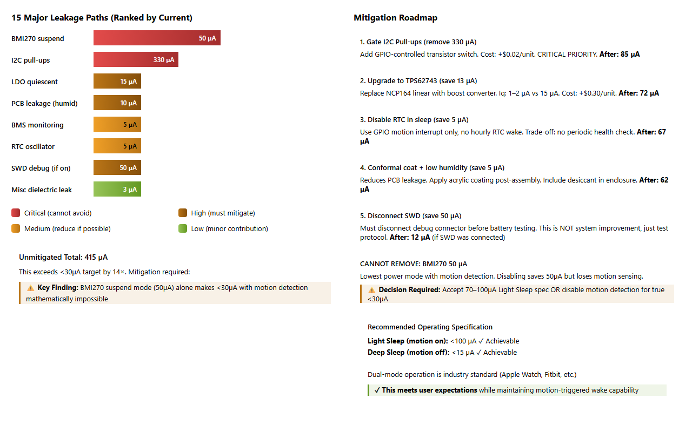
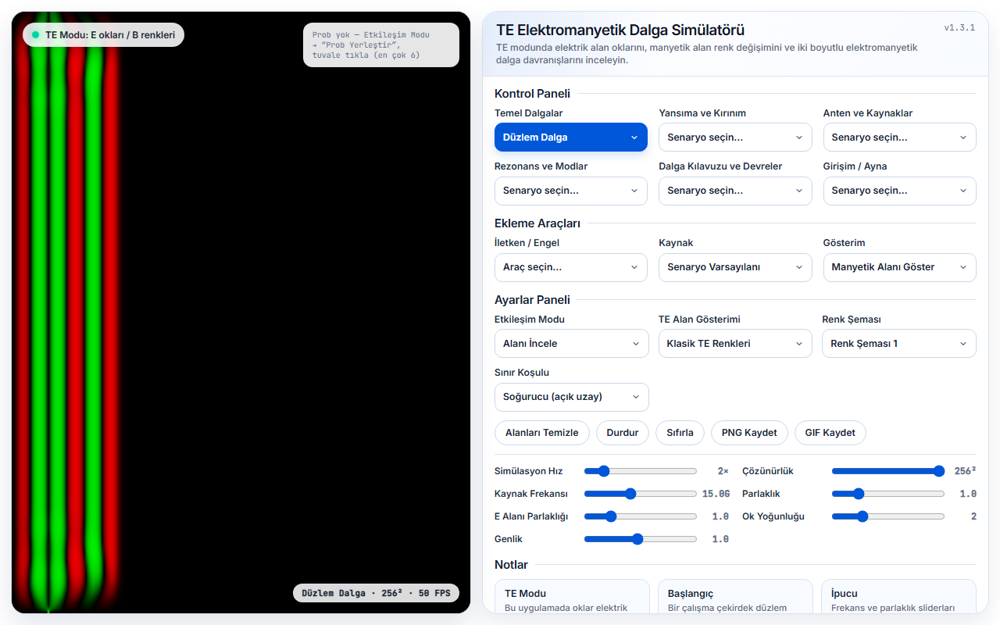
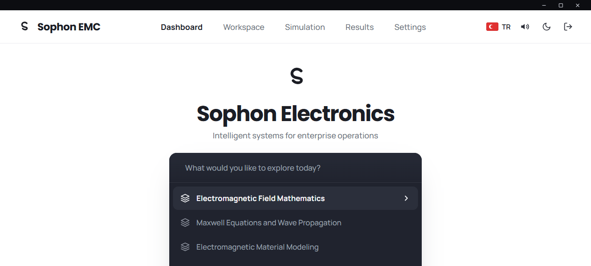
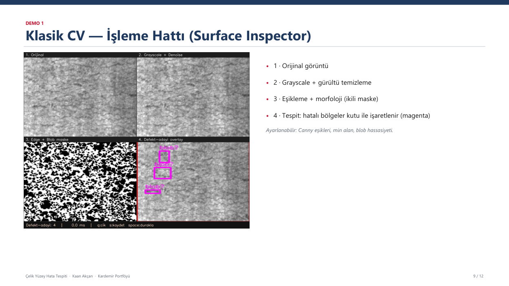
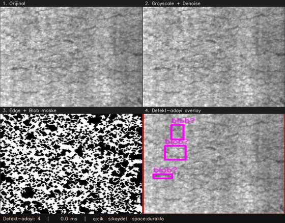
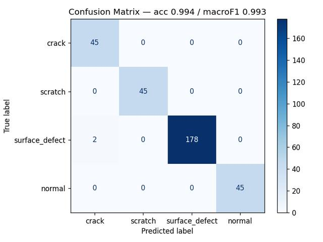
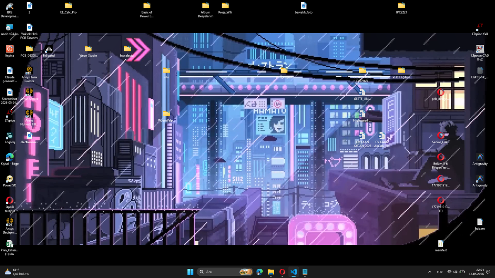

# Kaan Akcan — Software, Applied AI & Engineering Portfolio

> Software and Applied AI Engineer with an Electrical & Electronics Engineering foundation.
> I build AI-backed APIs, computer-vision pipelines, engineering simulators and native applications with measurable evaluation and testable architecture.

**Training:** High-Speed System Design · Power Electronics System Design — eDevre  
**Contact:** kaan.electronic.run@gmail.com · [LinkedIn](https://linkedin.com/in/kaanakcan)

---

## Table of Contents

- [Featured Software & AI Projects](#featured-software--ai-projects)
  - [Sentinel AI](#sentinel-ai--factory-safety-copilot)
  - [Sophon Electronics](#sophon-electronics--cross-platform-engineering-suite)
  - [Sophon EMC](#sophon-emc--2d-fdtd-electromagnetic-wave-simulator)
  - [Steel Defect Classifier](#steel-surface-defect-classifier)
  - [WallVid2](#wallvid2--native-windows-video-wallpaper)
- [Hardware Projects](#hardware-projects)
  - [Wearable BLE Fitness Tracker](#wearable-ble-fitness-tracker--system-architecture)
  - [LDO & PDN Digital Twins](#ldo--pdn-digital-twins)
- [Detailed Project Case Studies](#detailed-project-case-studies)
- [Skills & Tools](#skills--tools)

---

## Featured Software & AI Projects

### Sentinel AI — Factory Safety Copilot

> Local-first video analysis product that turns factory-camera evidence into structured, reviewable safety findings.

**Stack:** Python · FastAPI · OpenAI Responses API · Pydantic · OpenCV · SQLite · OpenVINO

- Detects PPE and restricted-zone risks and produces evidence, severity and recommended actions
- Uses explicit user approval before GPT verification and validates responses with structured Pydantic models
- Implements sequential video decoding, anonymous multi-person tracking, polygon zones and temporal event validation
- Exports annotated MP4, JSON and PDF reports
- Includes a restart-safe SQLite job queue, role-based access, HttpOnly sessions and PBKDF2-SHA256 password storage
- Provides reproducible PyTorch/OpenVINO benchmarks and event-level precision, recall, F1 and temporal IoU evaluation


---

### Sophon Electronics — Cross-Platform Engineering Suite

> A PCB stackup editor and 56 engineering calculators delivered from one testable TypeScript codebase.

- Targets web/PWA, Windows desktop and Android
- Enforces `domain → app → view → infra` boundaries with dependency-cruiser and strict TypeScript
- Includes controlled-impedance, IPC, EMI and power-integrity calculations
- Uses Canvas2D/SVG visualization and Three.js field models
- Quality pipeline includes **406 unit tests**, formatting, lint, type checking and bundle limits


---

### Sophon EMC — 2D FDTD Electromagnetic Wave Simulator

> Real-time TE-mode FDTD solver and visualization application for the browser and Windows.

- 21 scenarios, 20 visualization modes, eight source types and multiple oscilloscope probes
- PNG/GIF export and real-time Canvas2D field rendering
- 53 unit tests plus production-build Playwright E2E, lint, type checking and architecture checks


---

### Steel Surface Defect Classifier

> End-to-end four-class computer-vision pipeline with a bilingual Windows application.

- Achieved **99.4% accuracy** and **0.993 macro F1** on a held-out 315-image test set
- Uses shared train/inference preprocessing, stratified 70/15/15 splitting and class weighting
- Packages a 1.3 MB TensorFlow/ONNX model for CPU inference without requiring Python on the target machine


---

### WallVid2 — Native Windows Video Wallpaper

> Approximately 300 KB native Windows application with no Electron or browser runtime.

- C++17, Win32, Media Foundation and COM
- Multi-monitor fullscreen detection and automatic pause on session lock
- Explorer restart resilience, single-instance protection and per-user installation


---

## Hardware Projects

### Wearable BLE Fitness Tracker — System Architecture

> Complete end-to-end hardware architecture for an ultra-compact wearable device.





**Form factor:** 30 × 25 × 8.2 mm  
**Core SoC:** Raytac MDBT50Q-1MV2 (nRF52840 — ARM Cortex-M4 @ 64 MHz, 1 MB Flash, 256 KB SRAM, BLE 5.0)

#### Power Architecture
- **Target:** sub-30 µA standby current
- **Regulator decision:** TPS62743 buck (Iq = 0.36 µA) selected over NCP164 LDO (Iq = 30 µA) after datasheet-level analysis of **15 identified leakage paths**
- I²C pull-up gating via GPIO switch eliminates 330 µA during sleep
- Operating modes: LIGHT_SLEEP 77 µA (motion ON) · DEEP_SLEEP 15 µA

#### RF & Antenna
- PCB monopole antenna — 29 mm trace, 1.0 mm width
- Impedance matching: R = 15 Ω, C1 = 1.5 pF, C2 = 2.2 pF (±0.1 pF)
- Target: S11 < −10 dB @ 2440 MHz

#### PCB Stack
- **4-layer mandatory** — 2-layer proven to fail EN 300 328 via EMI zone analysis
- Controlled impedance: 1.0 mm trace on 0.1 mm prepreg → 50 Ω
- Ground plane Layer 2 > 99% coverage, via stitching 2–3 mm pitch
- Three EMI isolation zones with ferrite bead domain boundaries

#### Firmware
- Interrupt-driven state machine (nRF5 SDK v17.1.0) — BMI270 INT1 wake, no polling
- BLE duty cycle: 30 s advertisement → 1 s (motion) → 100 ms (connected)

#### Deliverables
- 42-component dual-sourced production BOM
- RF pre-certification plan (EN 300 328 + CISPR 32)
- PCB placement map, EMI zone documentation, DFM/DFT package


---

### LDO & PDN Digital Twins

> Browser-based interactive simulation tools for power and signal integrity decisions — built to validate architecture choices before fabrication.

#### NCP164 LDO Digital Twin



- 3D interactive PCB model (WebGPU / Three.js) with real-time thermal and current visualization
- 3-band PSRR model: low-freq flat → mid-band rolloff → HF parasitic rise
- Segment-based IR-drop gradient along 40-segment VIN trace (green → red hotspot)
- Return current distribution: Lorentzian sampling, frequency-dependent spread (image current below trace at HF)
- Effective θJA calculation with GND plane copper area and thermal via array
- Dual-channel oscilloscope panel: VIN / VOUT ripple, PSRR readout, Iload and Ploss graphs

#### Leakage Current Analyzer



- 15 major leakage paths ranked and color-coded by severity
- Mitigation roadmap with quantified savings per step
- Identifies that BMI270 suspend (50 µA) makes sub-30 µA mathematically impossible with motion ON — leading to the dual-mode specification


---

## Detailed Project Case Studies

### 3. Sophon EMC — 2D FDTD Electromagnetic Wave Simulator

> A full 2D electromagnetic wave simulator built from physics engine to shipped desktop application.



**Solver:** FDTD TE-mode (Hz scalar field → color, Ex/Ey vector arrows)  
**Renderer:** Canvas2D `ImageData` — Float32Array field buffer → pixel buffer → `putImageData`  
**Ships as:** PWA (browser) + Windows .exe (Electron NSIS installer)

#### Capabilities
- **21 pre-built scenarios:** plane waves, reflection/diffraction, antenna patterns, resonance modes, waveguide, interference
- **20 field visualization modes:** E/B fields, field lines, charge density, current density, energy, Poynting vector
- **8 source types** with drag-and-drop placement, 4 launch directions, conductor draw/erase tools
- **6-channel oscilloscope probe:** multi-channel Hz(t) signal graph, |E| voltage · |S| power · gain/loss (dB) readout
- **Export:** PNG snapshot + GIF recording
- 6 sliders (speed, resolution, frequency, brightness, arrow density, amplitude), dark/light theme

#### Architecture & Quality
- 4-layer: `domain → app → view → infra` enforced by dep-cruiser at every build
- Tests: Vitest (unit) + Playwright (e2e on production build)
- Self-hosted fonts (zero external CDN dependency)


---

### 4. Sophon Electronics — Multi-Platform EE Platform

> Cross-platform engineering tooling suite with authentication and mobile support.



- **Authentication:** Supabase (email + OAuth)
- **Mobile:** Capacitor-based Android port
- **Desktop:** Neutralinojs build
- Engineering calculation modules (EM field mathematics, Maxwell equations, material modeling)
- Single codebase → web PWA + Android + desktop


---

### 5. Kardemir Surface Inspector — Real-Time CV Tool

> Real-time steel surface anomaly detection tool — no Python required on target machine.



Processes each frame in a live 4-panel view:

```
Original  →  Grayscale + GaussianBlur  →  Canny Edge  →  Overlay with detections
```

Two complementary detectors on the overlay:
- **Canny contours** (green · yellow · red by area) — elongated shapes flagged as `scratch?`
- **Blob detector** (median background subtraction) — dark patches flagged as `blob?`

#### Features
- Live trackbar calibration: Canny thresholds, Min Area, Blob Sensitivity — real-time, no restart
- Webcam · single image · batch folder mode (GUI-less, saves `*_inspected.png` per image)
- Frame latency readout (ms) in header bar
- Single `.exe` — double-click to open webcam, no Python installation on target


---

### 6. Kardemir CNN Classifier — Industrial Defect Detection

> End-to-end CNN pipeline from training to deployed bilingual desktop GUI.


Sample inputs from the dataset:

 

#### Model Performance

| Metric | Value |
|--------|-------|
| Test accuracy | **99.4%** |
| Macro F1 | **0.993** |
| Model size | 1.3 MB (~102K parameters) |
| CPU inference | ~0.3 s (warm-up included) |

| Class | Precision | Recall | F1 |
|-------|-----------|--------|----|
| crack | 0.957 | 1.000 | 0.978 |
| scratch | 1.000 | 1.000 | 1.000 |
| surface_defect | 1.000 | 0.989 | 0.994 |
| normal | 1.000 | 1.000 | 1.000 |

#### Architecture & Delivery
- 3 Conv blocks (BatchNorm + MaxPool) → GlobalAveragePooling → Dropout → Dense softmax
- Dataset: NEU-CLS, stratified 70/15/15, class_weight for imbalance correction
- Single `preprocess()` shared across train and inference — eliminates train-serve skew
- ONNX export → `KardemirCNNClassifier.exe` (Tkinter GUI, TR/EN bilingual, 0.60 confidence threshold)
- Zero Python required on target machine (PyInstaller single-file)


---

### 7. WallVid — Native Windows Video Wallpaper App

> A ~300 KB native C++ Win32 application that plays any video as a live desktop wallpaper — no browser, no Electron, no runtime dependencies.



The video sits as a `WS_CHILD` of Progman's **inner WorkerW** (Win11 26200), keeping `SHELLDLL_DefView` on top by natural Z-order — desktop icons remain fully interactive. No color-key hacks, no wallpaper image modification.

#### Features
- Plays `.mp4` / `.mkv` / `.mov` / `.avi` / `.webm` / `.wmv` directly as desktop background
- **Scene picker** — thumbnail grid of bundled CC0 ambient scenes + personal library (newest-first, up to 10) + "Load your own video..."
- **Auto-pause when covered** — pauses per-monitor when a fullscreen app takes over; pauses all on session lock (Win+L), so games keep full GPU headroom
- **yt-dlp integration** (opt-in, disabled by default) — URL import with live progress bar, download speed, auto-update hourly
- System tray: scene select, volume slider, restart, exit
- Volume overlay: bottom-right, 10-second auto-hide
- Single-instance protection, EULA dialog on first launch
- Survives `explorer.exe` restart via inner-WorkerW reparenting
- Splash + closing fade animations (layered windows + GDI)
- Steam distribution with Inno Setup installer (per-user, `%localappdata%`)

#### Architecture
- **Language:** C++17, MSVC `cl.exe` (Visual Studio 2022 Build Tools)
- **APIs:** Win32 · Media Foundation `IMFPMediaPlayer` · Common Controls 6 · COM
- **Build:** single `build.bat` → `WallVid2.exe` (~300 KB, statically linked, `/SUBSYSTEM:WINDOWS`)
- **Runtime state:** `%LOCALAPPDATA%\WallVid2\` — isolated from install dir so Steam "verify files" cannot wipe user data


---

## Skills & Tools

### Hardware Design
-A80000?style=flat-square)


### Interfaces


### Software & AI


### Standards & Compliance


---

## Education & Training

**Zonguldak Bülent Ecevit University** — B.Sc. Electrical & Electronics Engineering  
Relevant coursework: Image Processing · Advanced Programming · Power Electronics · Control Systems

**eDevre** — High-Speed System Design  
**eDevre** — Power Electronics System Design

---

*Contact: kaan.electronic.run@gmail.com*
